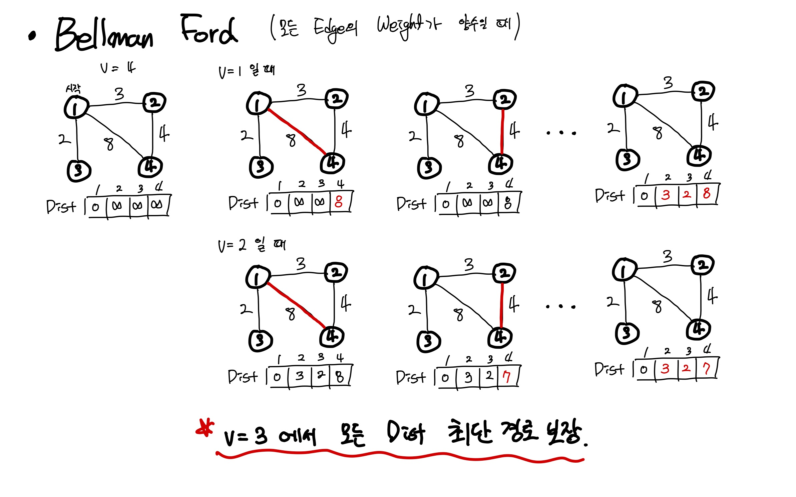
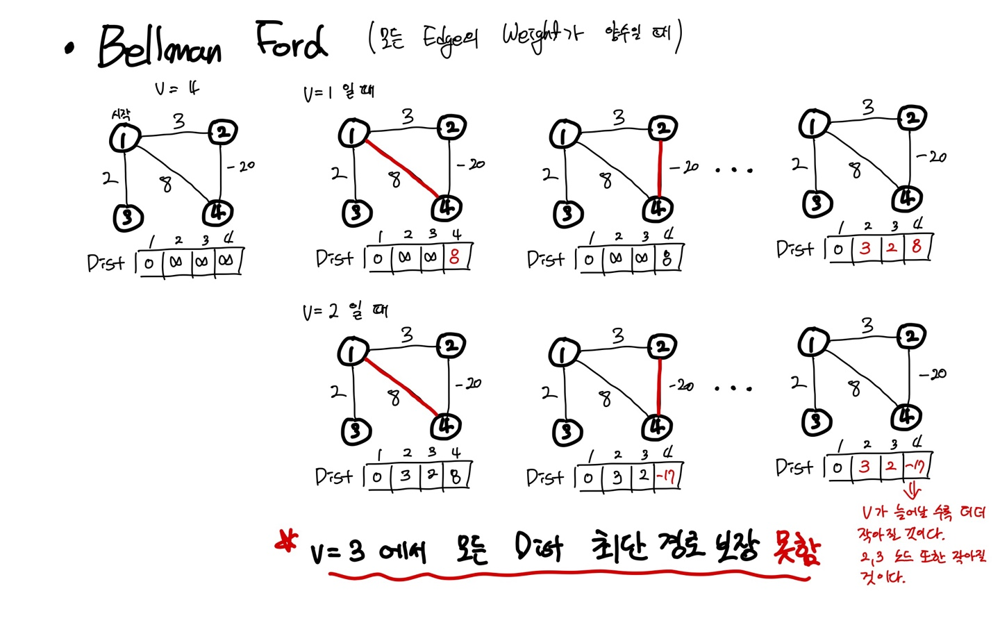

# Bellman Ford(벨만포드) 알고리즘

## 개념

Dijkstra, Floyd-Warshall 알고리즘 처럼 그래프에서 최단 경로를 찾는 알고리즘이다.

Bellman Ford 알고리즘은 임의의 시작노드 s에서 v 사이의 최단 경로를 구하기 위해 노드 s, u의 최단 경로 Dist(s, u)
에 u, v 사이의 가중치를 더한 값을 구한다.

$$D(s,v) = D(s,u) + w(u,v)$$

Bellman Ford 알고리즘은 최단거리 D(s,u)를 구할 때 그래프 내 모든 엣지에 대해서 **거리의 합을 최소값으로 계속 업데이트** 해주는 edge relaxation연산을 수행해준다.

이 연산을 몇 번을 해야 최단거리를 보장해줄까? s, u 사이 최단 경로는 s, u 일 수도 있고 u를 제외한 모든 노드 (|V| - 1)개가 최단경로 일 수 있다. 따라서 벨만 포드 알고리즘은 모든 엣지에 대해서 edge relaxation 연산을 수행하기 때문에 |V| - 1번 연산을 수행한다.

따라서 복잡도는 

- 시간 복잡도 : O(|V||E|) => Dense Graph인 경우 엣지 수가 대개 노드 수의 제곱에 근사이므로 O(V^3)까지 간다.

### Bellman Ford(양수 가중치만 존재) 예시



### 더 좋은 Dijkstra, Floyd-Warshall 있는데 굳이?
라고 생각할 수도 있지만 Bellman Ford 알고리즘으로만 풀 수 있는 문제들이 있다. 간선의 가중치가 음수를 포함할 때 Bellman Ford로 문제를 해결할 수 있다.

만약 가중치에 음수가 있고 앞선 예시처럼 사이클이 존재한다면 다음과 같은 상황이 벌어질 수 있다.

### Bellman Ford(음수 가중치가 존재) 예시



이런 특성으로 Bellman Ford 알고리즘을 사용하는 이유이다. 음의 사이클이 생성되는지 확인할 수 있는 최단거리 구하는 알고리즘이다.

만약 음의 사이클의 존재를 알고싶을 때 |V| - 1 번의 edge relaxation 연산을 수행 후 한번 더 수행했을 때 Dist[]의 업데이트가 발생하면 그것은 음의 사이클의 존재한다는 의미이다.

## 소스코드
### Cpp
```cpp
// Edge 의 정보를 담고있는 구조체
// struct Edge {
//   int start, dest;
//   int cost
//   Edge(int a, int b, int c) : start(a), dest(b), cost(c) {}
// }

// vertex의 최대 개수
#define V_MAX 1000
#define INF 987654321

// vertex의 개수 V, Edge를 담는 vector 컨테이너 edges
int V;
int dist[V_MAX];
vector<Edge> edges;

void init() {
    fill_n(dist, V_MAX, INF);
}

bool bellmanFord() {
    // Bellman Ford 알고리즘의 시작노드는 어디서든 상관 없다.
    dist[1] = 0;

    // |V| - 1 반복하며 모든 vertex의 최단거리 구하기
    for(int i = 0; i < V; i++){
        // 모든 edge 순회
        for(int j = 0; j < edges.size(); j++){
            int start = edges[j].start;
            int dest = edges[j].dest;
            int cost = edges[j].cost;

            dist[dest] = min(dist[dest], dist[[start] + cost]);
        }
    }

    for(int i = 0; i < edges.size(); i++){
        int start = edges[i].start;
        int dest = edges[i].dest;
        int cost = edges[i].cost;

        // 만약 업데이트가 발생하면 음의 사이클 존재
        if(dist[start] + cost < dist[dest]){
            return true;
        }
    }
    // 업데이트가 없다면 음의 사이클 존재하지 않음
    return false;
}

```

# 관련 문제

- 백준 1865
  
  https://www.acmicpc.net/problem/1865

# Ref.

https://ratsgo.github.io/data%20structure&algorithm/2017/11/27/bellmanford/