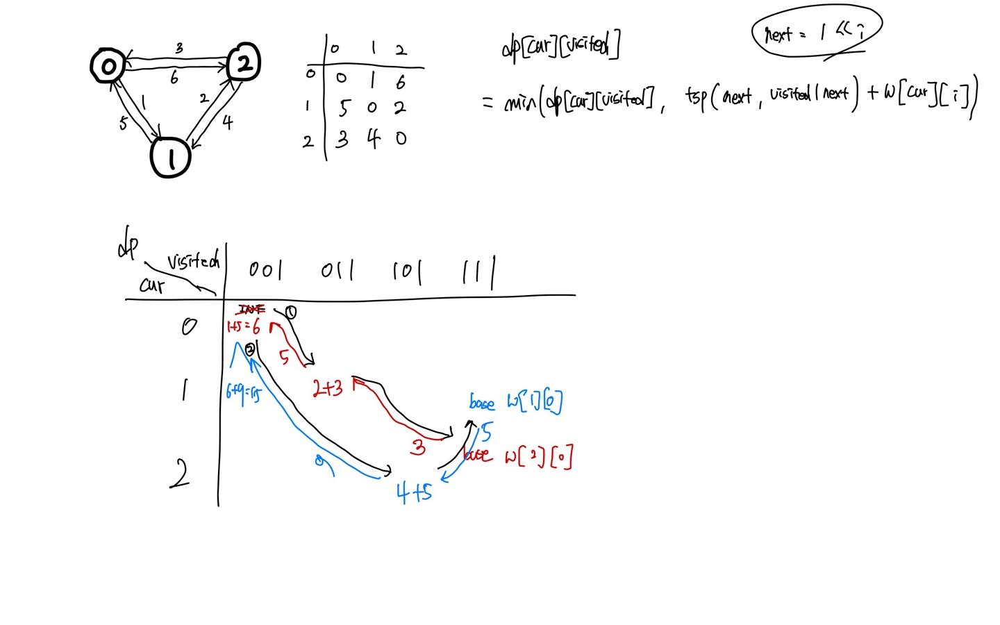

# 비트마스크 (Bit Mask)

## 비트마스크

정수의 이진수표현을 자료구조로서 사용하는 방법이다.

비트 마스크를 사용함으로서 

- **수행시간 단축**
- **코드 단축**
- **공간 복잡도 줄이기**

의 장점을 얻을 수 있다. 특히 세 번째 공간 복잡도를 줄이는 것이 가장 큰 장점이라 생각한다.

## 기본적인 비트 연산자

1. AND 연산 `10 & 11 = 10`

2. OR 연산 `10 | 11 = 11`

3. XOR 연산 `10 ^ 11 = 01`

4. NOT 연산 `~10 = 01`
   
5. SHIFT 연산 `1 << 3 = 100`, `100 >> 3 = 1`

## 비트 연산자 활용

### 집합

비트 하나가 하나의 원소를 의미하게 되어 1이 존재, 0이 부재를 뜻하게 되어 사용할 수 있다.

`A = 10101010`

`B = 10110111`

- 합집합 : `A | B`
- 교집합 : `A & B`
- 최소원소 지우기 : `A &= (A - 1)`
- 원소 포함여부 확인하기 : `if(A & (1 << n) > 0)`
- etc..

위와 같은 다양한 연산을 통해 집합 연산을 구현할 수 있다.

### 외판원 순회 문제 (Traveling Salesman Problem)

방향 그래프에서 한 도시(vertex)에서 시작해서 다시 해당 도시로 돌아오는 방법 중에 최소 비용을 구하는 알고리즘이다.

0 ~ 4의 도시를 도는 외판원 문제의 최소 경로를 구하려면 완전탐색을 하면 O(N!)으로 좋지 않은 알고리즘이다.

DP를 사용해서 풀 수 있는데 DP의 점화식은 다음과 같다.

`dp[cur][visited] = min(dp[cur][visited], tsp(next, visited | next) + W[cur][next]])`

현재 도시 `cur`이고 현재까지 방문한 도시의 집합이 visited일 때, 나머지 도시들을 순회한 최소 비용이다.

예를 들어 `cur`이 `3`이고 `visited`가 `01111`이면 **현재는 2번 째 도시에 있고 0,1,2, 3을 방문했다.** 라는 뜻이다.

`dp[3][01111]`의 최소비용을 구했다면 다시 도시 dp[3][01111]에 해당하는 것들은 나머지 도시들을 방문하지 않고 해당 최소비용을 사용하면 된다.

- 그림


## 소스코드
### Cpp
```cpp
int N;
int W[MAX][MAX];
int dp[MAX][65537], visited = 0;

int tsp(int cur, int visited) {

	// 모든 도시를 방문 했다.
	if (visited == (1 << N) - 1) {
		// 현재 노드에서 출발 도시로 가는 것이 불가능하다.
		if (W[cur][0] == 0)
			return INF;

		return W[cur][0];
	}

	// 같은 도시를 순회하고 현재 도시를 방문한 적이 있다.
	if (dp[cur][visited] != 0)
		return dp[cur][visited];

	dp[cur][visited] = INF;

	for (int i = 0; i < N; i++) {
		int next = 1 << i;
		// 이미 방문했거나 갈 수 없을 때
		if (W[cur][i] == 0 || (visited & next) > 0)
			continue;

		// 방문한 도시 visited들을 가지고 있는 현재 도시 cur을 순회한 최소비용 업데이트
		dp[cur][visited] = min(dp[cur][visited], tsp(i, visited | next) + W[cur][i]);
	}

	return dp[cur][visited];
}

```

# 관련 문제
- 백준 11723

    https://www.acmicpc.net/problem/11723

- 백준 2098

    https://www.acmicpc.net/problem/2098

# Ref
https://mygumi.tistory.com/361

https://kim6394.tistory.com/246
