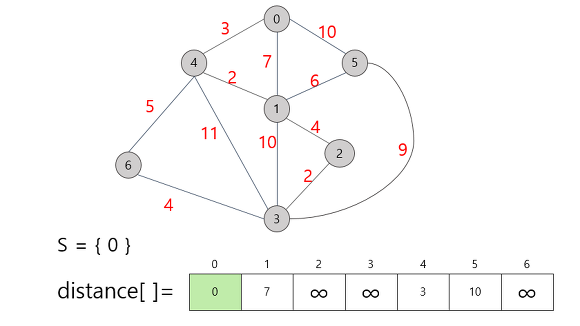
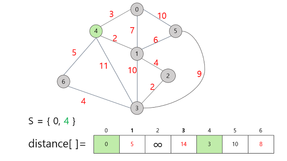
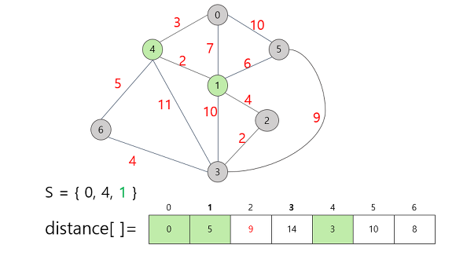

# 다익스트라 알고리즘
## 개념
그래프에서 한 vertex 에서 다른 모든 vertex로 가는 최단 거리를 구하는 알고리즘

- 시간 복잡도 : O(E + VlogV)
- 공간 복잡도 : depends on data structure





## 소스코드
### Cpp
```cpp
// 노드 개수(V), 에지 개수(E), 시작 지점(K)
int V, E, K;
vector<int> distance(V, INF)

void dijkstra(int K, vector<int>& distance) {
    // 최소 힙 pq
	priority_queue<pair<int, int>, vector<pair<int,int>>, greater<pair<int,int>>> pq;

    // 시작 지점인 K와 거리 0 pq에 삽입
	pq.push(make_pair(0, K));

    // 시작 지점은 0으로 초기화
	distance[K] = 0;


	while (!pq.empty()) {
        // 현재 가장 짧은 거리의 노드를 저장 & pop
		int cur = pq.top().second;
		int curCost = pq.top().first;
		pq.pop();

        // 현재 저장된 거리가 distance의 저장된 거리보다 짧으면 더 이상 해당 노드를 최신화 시킬 필요 없음
		if (distance[cur] < curCost)
			continue;

        // (인접리스트)
        // (현재 거리(curCost) + 다음 노드로 이동할 때 거리)와 distance[다음노드]를 비교해 distance[다음노드]가 길면 distance[다음노드]를 최신화 하기 위해 pq에 다음노드와 다음노드로 갔을 때 거리를 최신화 한 상태로 pq에 삽입한다.
		for (int i = 0; i < vec[cur].size(); i++) {
			if (distance[vec[cur][i].second] <= vec[cur][i].first + curCost)
				continue;

			distance[vec[cur][i].second] = curCost + vec[cur][i].first;
			pq.push(make_pair(vec[cur][i].first + curCost, vec[cur][i].second));
		}

	}
}
```

### 비교
간선이 많은 그래프(Dense Graph:밀집 그래프)의 최단경로를 찾을 때는 시간 복잡도가 O(E + VlogV)인 Dijkstra 알고리즘이 O(V^3)의 Floyd-Warshall 알고리즘보다 느릴 수 있다.

## Ref.
https://mattlee.tistory.com/50