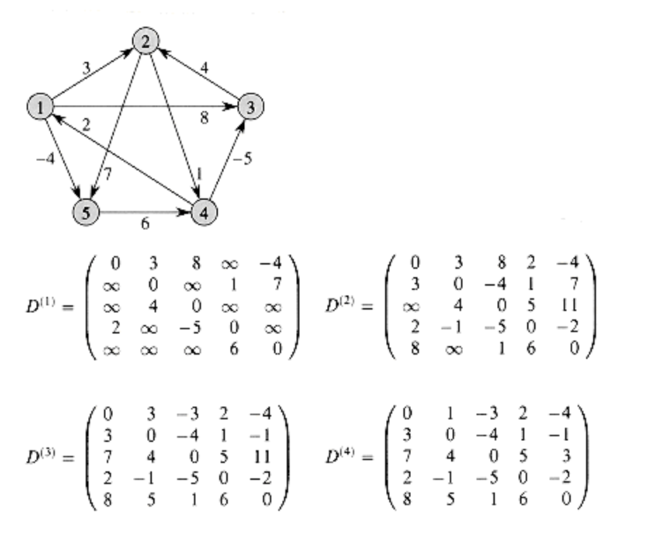

# 플로이드와샬 알고리즘
## 개념
그래프에서 모든 vertex 에서 다른 모든 vertex로 가는 최단 거리를 구하는 알고리즘

- 시간 복잡도 : O(N^3)
- 공간 복잡도 : O(N^2)  // adjacency matrix

임의의 vertex **S**에서 **E**로 가는데 걸리는 최단거리를 구하기 위해 **S**와 **E**사이 노드인 **M**에 대해 **S -> M**의 걸리는 최단거리와 **M -> E**의 걸리는 최단거리를 이용한다.

- 점화식
    
    dist[S][E]가 S에서 E로 가는 최단거리라고 할 때 초기 INF로 놓고 dist[S][E] = min(dist[S][E], dist[S][M], dist[M][E])를 수행해주면 최단거리를 보장할 수 있다.



## 소스코드
### Cpp
```cpp
int V; // 전체 vertex 수

for(int m = 0; m < V; m++) {
    for(int e = 0; e < V; e++) {
        for(int s = 0; s < V; s++) {
            dist[s][e] = min(dist[s][e], dist[s][m] + dist[m][e]);
        }
    }
}
```