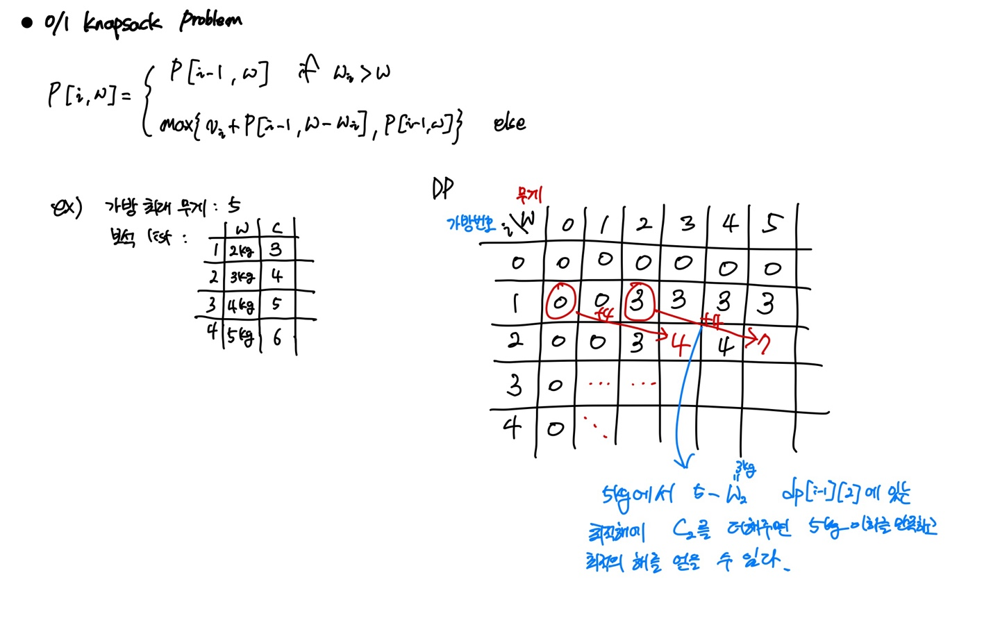

# Dynamic Programming (Knapsack Problem)

## 문제 정의

배낭의 최대 용량이 **W**이다. 배낭에 일정한 **cost**와 **weight**를 가지고 있는 보석을 넣을 때 배낭 무게를 초과하지 않고 cost의 합이 최대가 되도록 보석을 고르는 방법을 구하라.

- Fractinal Knapsack Problem
  
  보석을 쪼갤 수 있다고 가정할 때의 풀이 방법.
  단위당 가치가 높은 순으로 넣어(Greedy) 최적해를 얻을 수 있다.

- 0/1 Knapsack Problem

  Greedy로 해결했을 때 최적해를 가질 수 없다. 따라서 DP로 해결해야한다.

## 개념

DP의 기본적인 개념은 **<Principle of Optimality>** 이다. "주어진 문제를 풀기 위해, 해당 문제를 여러 하위 문제(Subproblem)으로 나누어 푼 다음, 그것을 결합해 문제를 해결하면 최적의 해를 보장한다."는 의미이다.

위의 개념의 0/1 knapsack 문제에 그대로 대입해보겠다.

- 집합 A가 n번째 보석을 포함하고 있지 않다면, A는 n번째 보석을 뺀 나머지 n-1개의 보석들 중에 최적으로 고른 부분집합과 같다.
  
- 집합 A가 n번째 보석을 포함하고 있다면, A에 속한 보석들의 총 가격은 n-1개 보석 중에 최적으로 고른 가격의 합에 n의 가격을 더한 것과 같다.(가방 최대무게 이하일 때)
  
점화식과 그림으로 나타내게 되면 다음과 같다.



## 소스코드
### Cpp

```cpp
#define WEIGHT_MAX 100
#define NUM_OF_BAG 10

int dp[NUM_OF_BAG][WEIGHT_MAX];
int weight[NUM_OF_BAG];
int cost[NUM_OF_BAG];

void knapsack(){
    for(int i = 1;i < NUM_OF_BAG; i++){
        for(int w = 0; w <= WEIGHT_MAX; w++){
            if(weight[i] < w)
                dp[i][w] = max(dp[i][w], dp[i - 1][w - weight[i]] + cost[i]);
            dp[i][w] = max(dp[i][w], dp[i - 1][w]);
        }
    }

    int answer = dp[NUM_OF_BAG][WEIGHT_MAX];
}
```