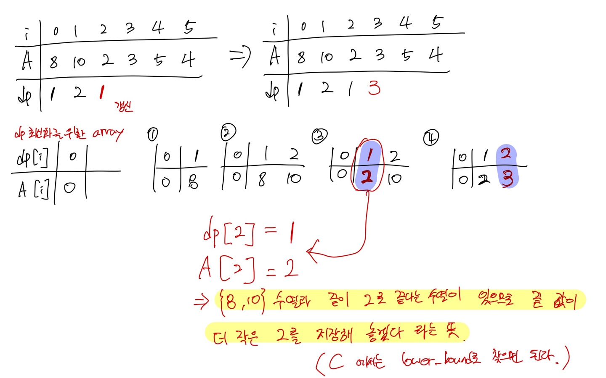

# LIS(Longest Increasing Subsequence) 알고리즘
## 개념
N개의 원소를 가진 배열에서 부분집합을 뽑았을 때, 항상 A[i] < A[i+1]를 만족하는 부분집합이 길이가 가장 최대인 부분집합(수열)을 Longest increasing subsequence(최장 증가 부분수열)이라고 한다.

예시로 [5, 2, 1, 4, 7, 3] 에서 최장 증가 부분수열은 [1(2), 4, 7]이다.
 
해당 문제는 dp를 사용해서 time complexity O(N^2)으로 해결이 가능하다.

### 점화식

dp[i]는 A[i]를 마지막 원소로 하는 부분수열의 길이의 합을 가지고 있다.

- dp[i] = max(dp[i], dp[j] + 1) (0 <= j < i, A[j] < A[i])

i 번째 dp를 채우기 위해서 0부터 i-1 번째 원소를 탐색하며 그 중 A[i]보다 작은 원소에 대하여 현재 dp[i]와 해당 원소의 최적값 dp[j]에 1을 더한 값을 비교해 최대값을 dp[i]에 저장한다.

## 소스코드
### Cpp
```cpp
int dp[MAX];
int A[MAX];

int LIS() {
    int ans = 0;

    dp[0] = 1;
    for(int i = 0 ; i < MAX; i++) {
        dp[i] = 1;
        for(int j = 0; j < i; j++) {
            if(A[j] < A[i]) {
                dp[i] = max(dp[i], dp[j] + 1);
            }
        }
        ans = max(ans, dp[i]);
    }

    return ans;
}
```

해당 코드는 O(N^2)의 time complexity를 갖기 배열의 길이가 커졌을 때 효율성이 떨어진다.

위 알고리즘을 한 문장으로 정리하자면 다음과 같다.
- **i 이전의 요소 중 A[i]보다 작은 수 중에 dp[j]가 가장 큰 값은 무엇인가?**

여기서 굳이 (j < i)를 매번 순회할 필요가 있을까 의문이 든다. 만약 dp[j] = k를 만족하는 **j중에 A[j] 값이 가장 작은 j**만 어딘가에 저장해 놓으면 해당 값을 이진 탐색(logN)으로 한번에 찾을 수 있다. 따라서 구현을 하면 O(NlogN)으로 최적화된 알고리즘이 완성된다.

### 내가 이해한 알고리즘 도식


## 소스코드
### Cpp
```cpp
int A[MAX];
vector<int> dp;

void LIS() {
    int ans = 0;

    // 처음 부분수열 포함
    dp.push_back(A[0]);

    for(int i = 1 ;i < MAX; i++) {
        if(dp.back() < A[i]>)
            // 부분수열이 이어짐
            dp.push_back(A[i]);
        else if(dp.back() > A[i]) {
            // 부분수열이 성립되지 않으므로 dp수열에서 A[i]보다 크면서 최소인 값을 교체해 준다. (새로운 부분수열의 등장)
            * lower_bound(dp.begin(), dp.end(), A[i]) = A[i];
            // 예시) dp 1, 3, 5에서 4 등장 => 1, 3, 4
        }
   }

    return dp.size();
}
```
# 관련 문제
- 백준 11055

    https://www.acmicpc.net/problem/11055

- 백준 1965

    https://www.acmicpc.net/problem/1965

- LeetCode 300

    https://leetcode.com/problems/longest-increasing-subsequence/


# Ref

https://namu.wiki/w/%EC%B5%9C%EC%9E%A5%20%EC%A6%9D%EA%B0%80%20%EB%B6%80%EB%B6%84%20%EC%88%98%EC%97%B4#s-3.2

https://godls036.tistory.com/10

https://mygumi.tistory.com/69