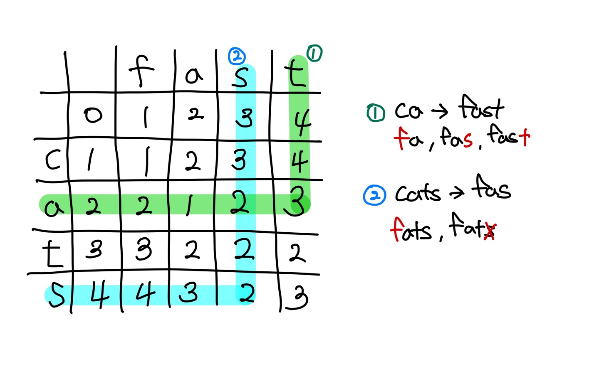
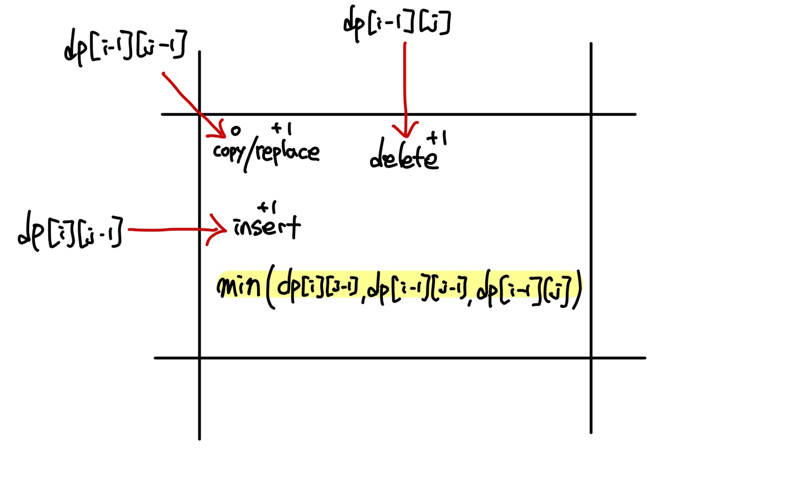
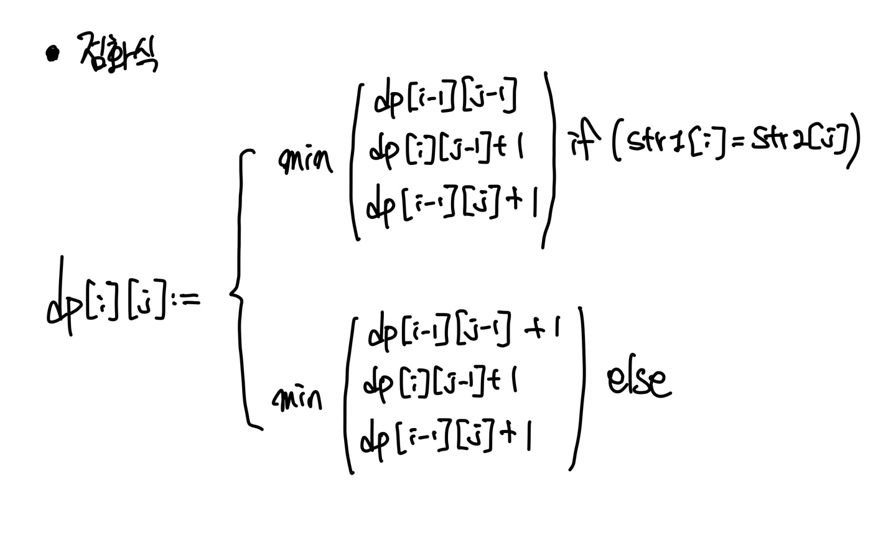

# Levenshtein Distance (편집거리 알고리즘)
두 문자열을 비교해 삽입, 변경, 삭제에 대한 비용을 계산하는 알고리즘 Introduction to Informational Retrieval 수업 내용에 있어서 한번 개념 정리 및 구현 해보려 한다.

Informational Retrieval에서는 편집거리로 검색어 오타같은 경우 편집거리가 가까운 단어를 에상해 검색의 정확도를 올려주는 역할을 담당한다. 그 외에 DNA 염기서열 유사도, N-gram 등에 쓰인다.

## 개념
### 레벤슈타인 거리란?
**문자열이 얼마나 비슷한지**를 나타내는 기준으로 Edit Distance(편집거리)라고도 한다. 예를 들어

- Levenshtein distance dog-do : 1
- Levenshtein distance cat-cart : 1
- Levenshtein distance cat-cut : 1
- Levenshtein distance cat-act : 2
- Damearu-Levenshtein distance cat-act : 1 (교환까지 가능)

위와 같이 **Edit Distance**를 나타낼 수 있다.

해당 알고리즘은 Dynamic Programming 기법을 사용한다.

프로그램 동작 과정은 다음과 같다.

1. 2차원 dp표를 만든다.
2. 첫 행과 첫 열은 문자열의 길이와 같다. null -> str (str.size() = n)으로 가려면 n번 insert이고 str -> null 으로 가려면 n번 delete하기 때문이다.
3. (1,1)위치부터 차례로 최소 distance를 채워가면 된다.
    - upper left : 현재 위치 문자열의 문자가 같다면 upper left로부터 **copy연산** 이다. 따라서 upper left의 숫자를 그대로 가져온다. / 문자가 다르다면 upper left로부터 **replace연산**이다. 따라서 upper left의 숫자에 1을 더한다.

    - upper : upper에 저장되어 있는 숫자는 최적의 dist가 있다. 따라서 1을 더한다. (길이가 달라지기 때문에 **delete 혹은 insert연산** 무조건 필요하기 때문에)

    - left : left도 upper와 마찬가지로 최적의 dist를 가지고 있기 때문에 1을 더한다.
4. 위 세 연산의 최소값을 해당 위치에 끝날때 까지 차례로 저장한다.

#### 그림



#### 점화식


## 소스코드
### Cpp
```cpp
#define MAX 10001

int dp[MAX][MAX];

void init() {
	// 2차원 배열의 첫 행, 열 초기화
	for (int i = 0; i < MAX; i++) {
		dp[0][i] = i;
		dp[i][0] = i;
	}
}

void levenshtein(string str1, string str2) {
	init();

	for (int i = 1; i <= str1.size(); i++) {
		for (int j = 1; j <= str2.size(); j++) {
			if (str1[i - 1] == str2[j - 1]) {
				dp[i][j] = min(dp[i - 1][j - 1], min(dp[i - 1][j] + 1, dp[i][j - 1] + 1));
			}
			else {
				dp[i][j] = min(dp[i - 1][j - 1] + 1, min(dp[i - 1][j] + 1, dp[i][j - 1] + 1));
			}
		}
	}
}
```

# 관련 문제
- 백준 15483

    https://www.acmicpc.net/problem/15483


# Ref
https://renuevo.github.io/data-science/levenshtein-distance/