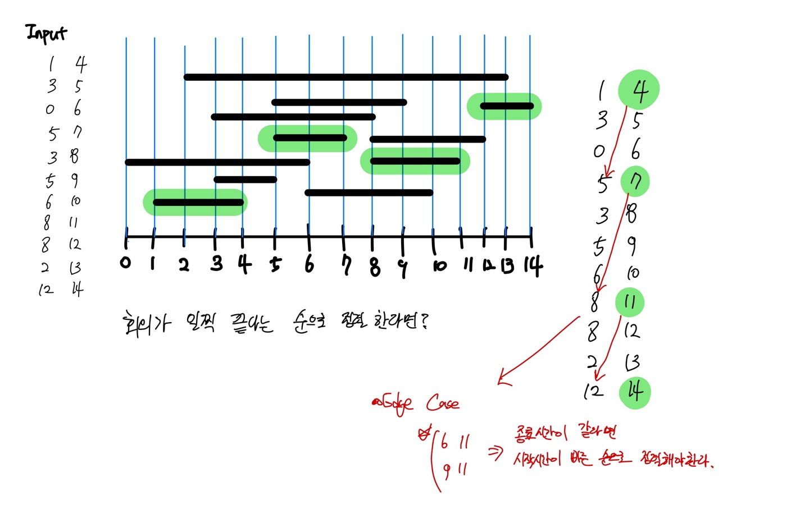

# 그리디 알고리즘 (회의실 배정 문제)



## 소스코드 (백분 1931 회의실 배정 문제)
### CPP
```cpp
int N;
vector<pair<int, int>> vec;

// 종료 시간이 같으면 시작시간이 짧은 순서대로 정렬
// 종료 시간이 다르면 종료시간이 작은 순서대로 정렬
bool cmp(pair<int,int> a, pair<int,int> b) {
	if (a.second == b.second)
		return a.first < b.first;
	else
		return a.second < b.second;
}

int main() {

	ios::sync_with_stdio(false);
	cin.tie(0);
	cout.tie(0);

	cin >> N;

	int a, b;
	for (int i = 0; i < N; i++) {
		cin >> a >> b;
		vec.push_back({ a, b });
	}

	sort(vec.begin(), vec.end(), cmp);
	
	int ans = 0;
	int endTime = 0;

	for (int i = 0; i < N; i++) {
		if (endTime <= vec[i].first) {
			endTime = vec[i].second;
			ans++;
		}
	}

	cout << ans << "\n";


	return 0;
}

```