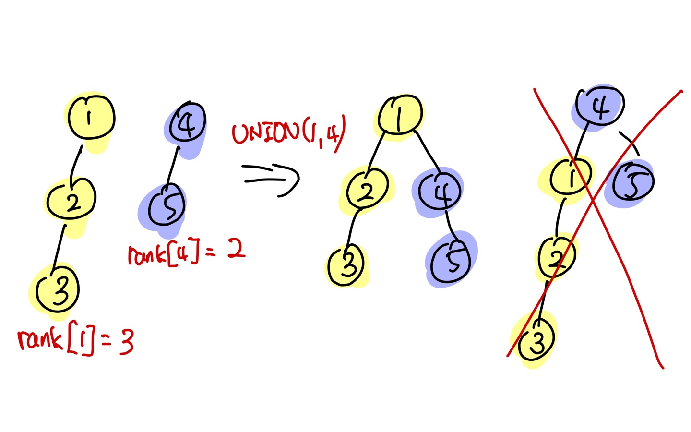

# Union_Find(Disjoint Set) - 합집합 찾기 알고리즘
## 개념
서로소인 부분집합들을 계속해서 tracking 할 수 있는 자료구조. 그래프에서 Cycle의 여부를 판별하는 알고리즘으로 자주 쓰여 그래프 쪽으로 분류해놨다.

이 알고리즘은 두 개의 operation으로 구현할 수 있다.

- **Find(x)** : x라는 요소가 어떤 부분집합 안에 속해있는지 알려준다.
- **Union(x, y)** : 부분집합 x, y를 합집합 연산을 수행한다.


## 소스코드
### Cpp
- 기본적인 방법
```cpp
int parent[MAX];
/* initialize
현재 모든 수가 disjoint하다. (parent[x] = x 자기자신)
for(int i = 0; i < MAX; i++) {
    parent[i] = i;
}
*/

void Union(int x, int y) {
    // 각 노드의 부모 노드를 찾아온다.
    int a = Find(x);
    int b = Find(y);

    // 한쪽의 부모노드를 변경한다.
    parent[a] = b;
}

void Find(int x) {
    /*
    * 해당 노드의 부모로 가는 재귀를 호출하다 root에 도착하면 root를 반환시켜 
    * 최종적으로 root의 노드가 반환된다.
    */
    if(parent[x] == x)
        return x;

    return Find(parent[x]);
}
```
하지만 위와 같은 방법으로는 원소의 개수가 N일 때 최악의 경우 O(N)의 성능을 같는다. 트리를 사용하는 (O(logN)) 이유가 딱히 없어 보인다.
- 트리 구조가 완전 비대칭인 경우 (한 쪽으로만 노드가 붙어있다)
- Union, Find 모두  O(N)의 성능을 가진다.

따라서 다음과 같은 최적화 과정을 거친다.

<br/><br/>
### Find 최적화(경로 압축)
```cpp
void Find(int x) {
    if(parent[x] == x)
        return x;

    /*
    * find를 수행하면서 만나는 노드들의 경로를 압축한다.
    * 위와 같이 트리의 depth가 짧아져 효율적인 O(logN)의 find 수행이 가능해진다.
    */
    int tmp = Find(parent[x]);
    parent[x] = tmp;
    return tmp;
}
```
예시)

1 -> 2 -> 3 -> 4 (find 수행 전)

1 -> 2, 1 -> 3, 1 -> 4 (find 수행 후)

<br/>

### Union 최적화(Union-by-rank)
```cpp
int ranks[MAX];
/* initialize
트리의 높이, 1로 초기화
for(int i = 0; i < MAX; i++) {
    ranks[i] = 1;
}
*/

void Union(int x, int y) {
    int a = Find(x);
    int b = Find(y);

    // 트리의 높이가 낮은 쪽에 붙여야 트리가 높아질 위험이 줄어든다.
    if(ranks[a] < ranks[b]){
        parent[a] = b;
        ranks[b] += ranks[a];
    }
    else if(ranks[a] > ranks[b]){
        parent[b] = a;
        ranks[a] += ranks[b];
    }
}
```
예시)

1 -> 2 -> 3, 4 -> 5 두 부분집합이 있고 1과 4를 union 한다고 해보자
이 때 ranks[1] = 3, ranks[4] = 2

먄약 높은쪽에 붙이게 된다면 4 -> 1 -> 2 -> 3 으로 트리의 깊이가 깊어질 확률이 높다.

따라서 1 -> 4 -> 5, 1 -> 2 -> 3 이 되도록 낮은 쪽에 트리를 붙여준다.



## Cycle 찾기
그래서 위의 방법으로 그래프의 Cycle을 어떻게 찾냐, 간략하게 설명하고 다른 페이지에서 설명.

그래프가 주어졌을 때 간선마다 Union-Find를 하면서 이어간다. 만약 Union을 수행 하다가 parent가 똑같은 x, y가 왔다면 그것은 사이클을 가지는 그래프인 것을 알 수 있다.

# 관련 문제
- 백준 1717

    https://www.acmicpc.net/problem/1717

- 백준 1976

    https://www.acmicpc.net/problem/1976

- 백준 10775

    https://www.acmicpc.net/problem/10775

- 

# Ref
https://www.geeksforgeeks.org/union-find/

https://ssungkang.tistory.com/entry/Algorithm-%EC%9C%A0%EB%8B%88%EC%98%A8-%ED%8C%8C%EC%9D%B8%EB%93%9CUnion-Find

https://gmlwjd9405.github.io/2018/08/31/algorithm-union-find.html

https://jackpot53.tistory.com/92